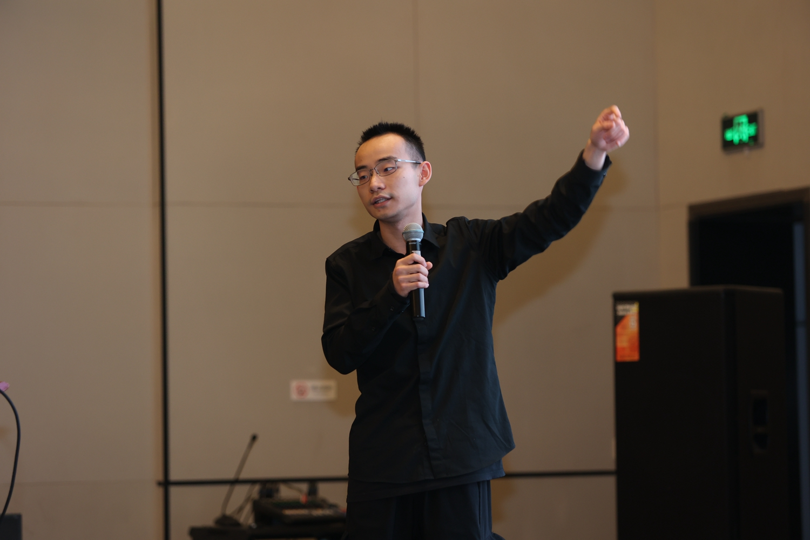
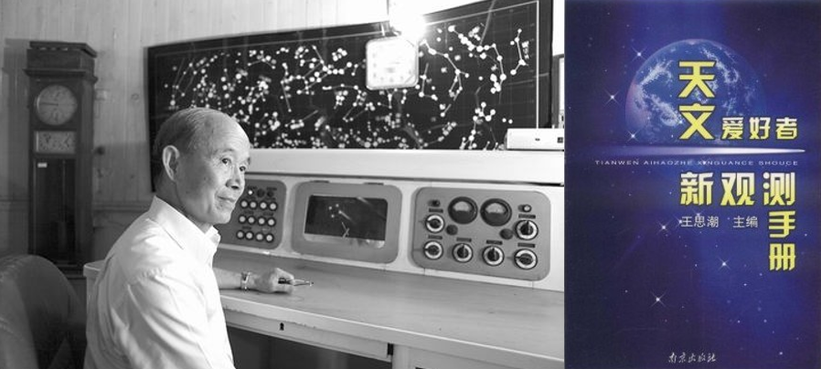
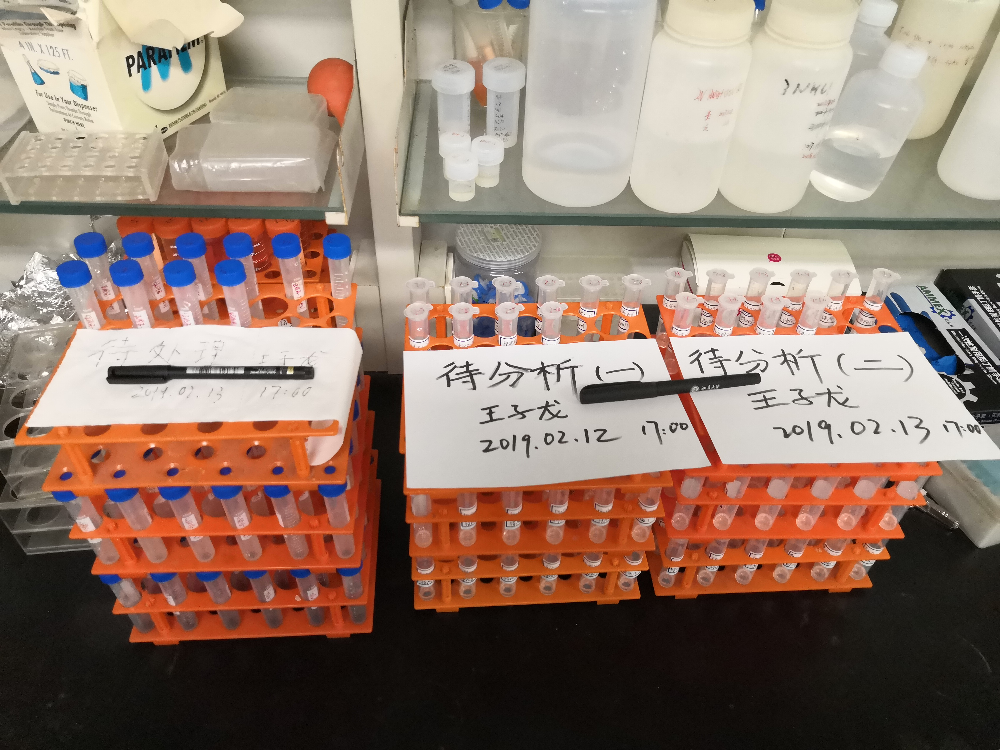
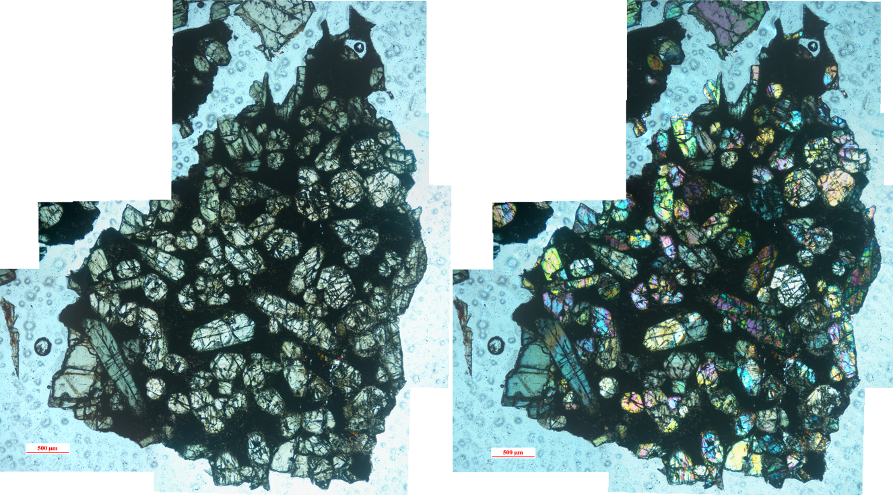
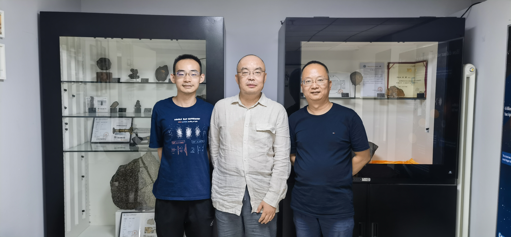
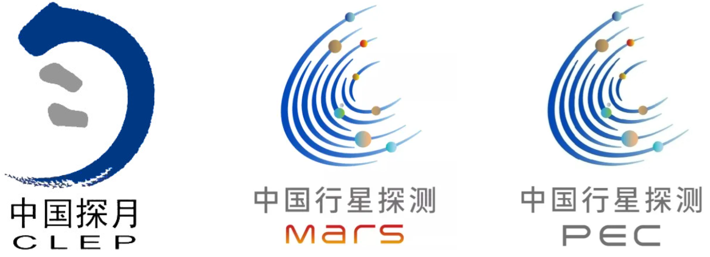

> I was giving a talk at the International Conference of Deep Space Sciences in Hefei City, Anhui Province, China. Photo taken on Apr 22nd-27th, 2023.

---

I was born in [Shandong Province](https://en.wikipedia.org/wiki/Shandong), [China](https://en.wikipedia.org/wiki/China), in February 2000. I am now a PhD student in [School of Earth and Space Sciences, Peking University](https://sess2.pku.edu.cn/english/index.htm). I am dedicated to becoming a professional researcher in the field of planetary science, with a particular focus on meteoritics, petrology, mineralogy, and volcanology. Please find my newest version of CV here: [Zilong's Curriculum Vitae](main.pdf).

## About my name

My name is **Zilong Wang** (or Zi-Long Wang, "Zi-Long" is the given name and "Wang" is the family name/surname), a common name in Chinese, with a writing shape like "王子龙". The [International Phonetic Alphabet (IPA)](https://en.wikipedia.org/wiki/International_Phonetic_Alphabet) transcription for my name in Mandarin Pinyin pronunciation is **/wɑːŋ tsɨ˨˩ lʊŋ˧˥/**.

- Wang (王) → /wɑːŋ/ (similar to "wong" in English, with a long "a" sound)
- Zi (子) → /tsɨ˨˩/ (/ts/ is an aspirated "ts" sound, /ɨ/ is a high unrounded vowel like in "rose" in Russian, with a falling tone)
- Long (龙) → /lʊŋ˧˥/ (/lʊŋ/ sounds like "loong," with a rising tone)

In Chinese, "Wang (王)" means "king", "Zi (子)" means "child" or "son", "Long (龙)" means "dragon". 

My name comes from a traditional Chinese idiom, **"Wàng zǐ chéng lóng" (望子成龙)**, which literally means **"hoping one’s child will become a dragon"**. In Chinese culture, the dragon symbolizes strength, success, and good fortune. Since my surname "Wáng" (王) sounds similar to "Wàng" (望), which means "hope" or "expect", my name carries the meaning of "hoping for a bright and successful future".

It’s also worth noting that "Wang" (王) is the most common surname in China, with over 100 million people sharing it. Because of this, you’ll often see academic papers citing "Wang et al. (xxxx)," but these are actually written by many different people, not just one author.

My full name is also extremely common in China. Based on my own observations, in eastern China, about one in every 2,000 people has the same name as me. Given China’s current population of 1.41 billion, this means that around 700,000 people in China share my name!

Because of how common my name is, I’m happy to use a few nicknames instead. I have two main nicknames:

- **"Lǎo Wáng" (老王) – "Old King"**
  This nickname has been around since my middle school days, and my friends still like to call me this. The reason is that my birthday falls in the first lunar month of the Chinese calendar. According to Chinese tradition, people born in this month are often referred to as "Dà" (big/elder) and are considered "older" than others born in the same year. Because of this, my friends jokingly called me "Lǎo Wáng" (Old King), and the name just stuck.
- **"Dragon Prince" (English nickname)**
   This nickname is a direct translation of my Chinese given name. In Chinese, "Wáng Zǐ" (王子) means "Prince" (King’s Son), and "Lóng" (龙) means "Dragon". However, despite what the name suggests, I have no connection to any historical Chinese royal families—it’s purely coincidental!

## About my professional background

When I was 11 years old, [an observational experience of a total lunar eclipse](https://en.wikipedia.org/wiki/June_2011_lunar_eclipse) sparked my deep interest in astronomy. That same year, China published a bestselling astronomy book titled "*New Observation Handbook for Astronomy Enthusiasts*", written by [Wang Sichao](https://en.wikipedia.org/wiki/Wang_Sichao), a researcher at the [Purple Mountain Observatory of the Chinese Academy of Sciences](https://english.pmo.cas.cn/). Guided by this book, I became determined to study astronomy seriously.

> My earliest mentor, Wang Sichao (left), and his book, "New Observation Handbook for Astronomy Enthusiasts" (right). On June 17, 2016, Wang Sichao passed away suddenly due to a cerebral hemorrhage. We miss him dearly.

At the time of its publication, Wang Sichao was already in his 70s, yet he remained an approachable and kind-hearted scholar, always encouraging and supporting astronomy enthusiasts like myself. When I was 12 or 13 years old, I exchanged emails with him, discussing my astronomical questions and thoughts. He enthusiastically responded with detailed explanations and even praised me as "*a diligent learner and a thoughtful astronomy enthusiast*". I remain deeply grateful for his guidance.

Beyond astronomy, Wang Sichao was also one of the earliest scholars in mainland China to study meteoritics. He led the official international classification and research efforts on several significant meteorite fall events in China, including [the 1976 Jilin meteorite shower](https://www.lpi.usra.edu/meteor/metbull.php?code=12171) and [the 1997 Juancheng meteorite shower in Shandong Province](https://www.lpi.usra.edu/meteor/metbull.php?code=12203). At that time, many amateur meteorite enthusiasts were emerging in China, and the public had numerous questions about meteorites. Wang Sichao patiently answered them all, sharing his knowledge in an accessible way.

I was no exception—thanks to his clear and engaging explanations, I quickly learned meteorite identification techniques, making him my earliest mentor on my path toward a professional career in planetary science. After his passing, I made a firm decision to become a planetary scientist like him.

At the age of 18, I was admitted to the [Department of Geology at Peking University](https://sess.pku.edu.cn/). During my first two years of undergraduate studies, I focused on fundamental courses in mathematics, physics, chemistry, biology, and computer science, with little direct exposure to planetary science. However, I began early laboratory training, gaining initial experience in scientific research.

In the first half of 2019, at the age of 19, I joined Professor [Bao Huiming](https://www.icier-nju.org/Huiming-Bao/)’s research group, where I learned about oxygen isotope studies. Later, I joined Professor [Shen Bing](https://sess.pku.edu.cn/info/1154/1937.htm)’s group, where I conducted experiments using various chemical reagents to stepwise extract different iron-bearing minerals from powdered rock samples. Both Prof. Bao and Shen were humorous, supportive, and highly encouraging mentors, and I had a wonderful time learning to conduct research in their labs.

> Some of my experimental samples during my time conducting research in Prof. Shen's laboratory. Photo taken on February 12, 2019.

In the second half of 2019, I met my current advisor, Professor [Tian Wei](https://www.researchgate.net/profile/Wei-Tian-16). He is a passionate, creative, and free-spirited scientist, and from our very first meeting, he left a deep impression on me. He told me that he strongly believed the next decade would be a golden era for planetary science in mainland China. However, at Peking University, few researchers were actively working in this field, especially in the analysis and study of extraterrestrial samples. He hoped to find a student to pioneer new research in planetary materials science with him—something that perfectly aligned with my long-standing interests. We immediately hit it off, and in December 2019, I officially joined [his research group](https://www.researchgate.net/lab/PKU-CPaSS-Wei-Tian).

In the first half of 2020, we began our first extraterrestrial sample study, using a Martian nakhlite meteorite—[NWA 5790](https://www.lpi.usra.edu/meteor/metbull.php?code=49470). Under Prof. Tian’s guidance, I conducted scanning electron microscopy (SEM) and electron probe microanalysis (EPMA) to investigate the oxygen fugacity conditions under which this meteorite formed. [Our findings were published in 2021](https://earth-planets-space.springeropen.com/articles/10.1186/s40623-021-01492-3) in *Earth, Planets and Space*, marking the first research paper focused on meteorite sample analysis ever published from Peking University's School of Earth and Space Sciences since its founding. As the first author of this paper, I felt deeply honored.

> The first meteorite I analyzed - martian nakhlite NWA 5790. 

After that, we acquired more meteorite samples for analysis and took advantage of the opportunity brought by [the Chang’e-5 lunar sample return mission](https://www.planetary.org/space-missions/change-5) to further train my research skills. By this point, I had become proficient in SEM and EPMA analysis and was able to interpret the petrography and petrogenesis of meteorites. My second advisor, Prof. [Wang Wei-(RZ)](https://orcid.org/0000-0002-2311-7012), played a crucial role in providing the funding and instrumental support necessary for the analysis and testing of these samples. Additionally, I began working on in-situ analysis techniques, such as the laser-ablation inductively coupled plasma mass spectrometry (LA-ICPMS) and the secondary-ion mass spectrometry (SIMS). However, due to the limited analytical facilities in our department, our capabilities in sample analysis and testing were less competitive compared to researchers at other institutions, such as [the Institute of Geology and Geophysics, Chinese Academy of Sciences (IGGCAS)](https://english.igg.cas.cn/).

Seeing this limitation, Prof. Tian suggested that I shift my focus toward computational modeling. This path, however, came with significant challenges. First, we had no prior experience in this area. Second, I do not consider myself highly intelligent, and learning the underlying physics and programming principles behind geological processes was a slow and difficult journey for me. 

> Me with Professor Tian (center) and Mr. Zhu Hao (right), Chairman of Xuanyuan Fourteen Starry Sky Culture in Beijing. Photo taken at Mr. Zhu Hao’s meteorite collection base on July 10, 2024.

Nevertheless, progress was made. While reproducing previous studies, we gradually learned various modeling techniques, such as trace element partitioning modeling, crystal diffusion modeling, crystallization kinetics calculations, magma degassing simulations, thermodynamic simulations using MELTS, Monte Carlo and Bayesian statistical analysis, etc. Over time, we were able to incorporate these methods into our research papers. So far, I have published several papers applying these techniques to [the study of Mars, the Moon, and Vesta](https://sess.pku.edu.cn/info/1078/3487.htm), and am eager to learn these techniques more.

However, this does not mean that I have fully resolved my "survival crisis" in planetary materials science. Many senior scholars have advised me that **to thrive in the increasingly competitive field of planetary science, one must develop a unique area of expertise—one that others cannot easily surpass**. This specialization is key to long-term success in the field.

Yet, my research so far has been broad rather than focused. I have explored various methods and directions, but my work lacks a concentrated specialty. If I were to define my current expertise, it would be "**using fundamental petrographic, mineralogical, and geochemical analysis methods, combined with statistical and modeling approaches, to semi-quantitatively study the petrogenesis of extraterrestrial rock samples**". However, this technical threshold is not particularly high, nor does it allow me to provide broadly applicable insights into major scientific questions. Clearly, I need to put in more effort to develop a truly specialized skill set and refine my scientific taste.

Recognizing this, I realized that I need more learning and collaboration opportunities to clarify my personal development path and enhance my ability to generate innovative scientific insights. In January 2025, I traveled to [Ruhr University Bochum](https://www.ruhr-uni-bochum.de/de) (under the support of [China Scholarship Council](https://www.csc.edu.cn/)) to work with Dr. [Ralf Dohmen](https://www.geo.ruhr-uni-bochum.de/arbeitsrichtungen/petrologie-und-geochemie/personal/dr-ralf-dohmen) and Prof. [Sumit Chakraborty](https://www.geo.ruhr-uni-bochum.de/arbeitsrichtungen/petrologie-und-geochemie/personal/prof-sumit-chakraborty), engaging in in-depth studies on diffusion chronology in extraterrestrial samples. I believe diffusion chronometry is a powerful tool that can provide precise time constraints for various geological processes in other planets.

Additionally, I have been collaborating with Prof. [Hu Sen](https://igg.cas.cn/sourcedb_igg_cas/cn/zjrck/201502/t20150211_4312185.html) at IGGCAS and Prof. [Li Huijuan](https://www.researchgate.net/profile/Huijuan-Li-10) at the [Beijing High Pressure Science Center](https://hpstar.ac.cn/) to further investigate the migration and evolution of volatiles in meteorites. Since volatiles are closely linked to life, this topic is expected to become a key focus in future planetary exploration.

Looking ahead, I hope to continue learning and growing in the field of planetary science. My goal is to contribute innovative scientific discoveries, pushing the boundaries of human knowledge. I hope I could live up to the expectations of my mentors, peers, and my country, while also staying true to my own aspirations and dreams. Keep going!

