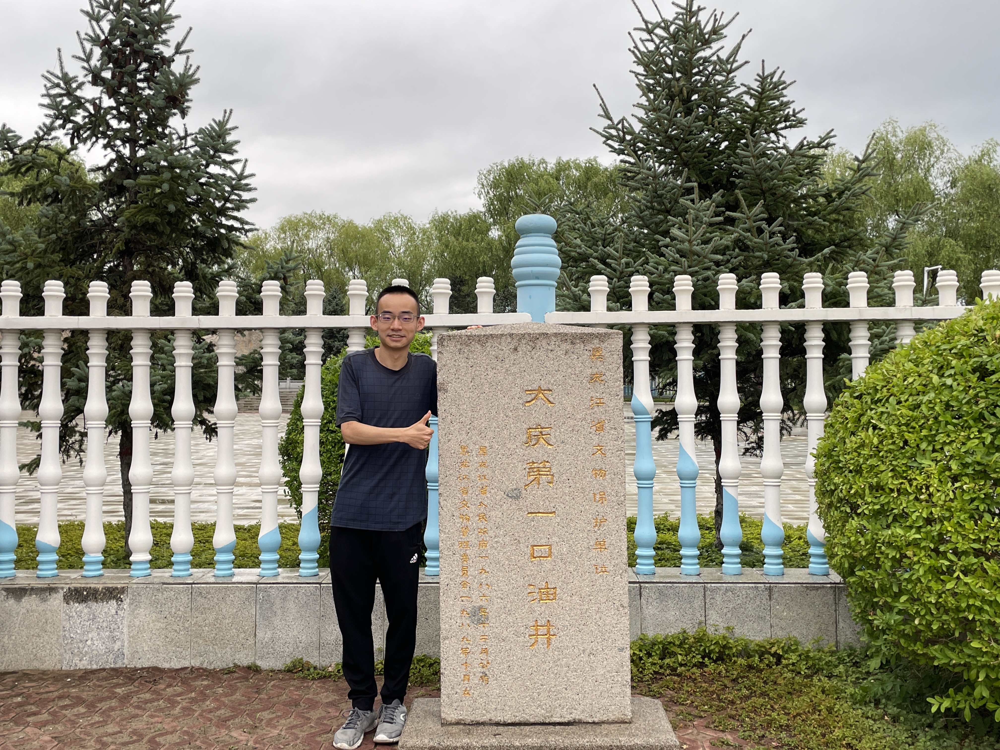



I stand next to the monument of the "First Oil Well in Daqing City, Heilongjiang Province". Photo taken on July 13, 2022.

Education
======
* **Ph.D** in [Geology (Mineralogy, petrology and economic geology)](https://sess.pku.edu.cn/), [Peking University](https://www.pku.edu.cn/), 2027 (expected)
  * Supervisor: [Prof. Wei Tian](https://sess.pku.edu.cn/info/1152/1849.htm), [Prof. Ping-Ping Liu](https://sess.pku.edu.cn/info/1152/1855.htm), [Prof. Wenzhe Fa](https://sess.pku.edu.cn/info/1157/2008.htm)

* **B.S.** in [Geochemistry](https://sess.pku.edu.cn/), [Peking University](https://www.pku.edu.cn/), 2022
  * Supervisor: [Prof. Wei Tian](https://sess.pku.edu.cn/info/1152/1849.htm)

Work experience
======
* 2025.01-2027.01 (expected): **Visiting Student**
  * [Institut für Geologie, Mineralogie und Geophysik](https://www.geo.ruhr-uni-bochum.de/), [Ruhr-Universtät Bochum](https://www.ruhr-uni-bochum.de/de)
  * Duties included: Timescales and diffusion kinetics of extraterrestrial samples
  * Supervisor: [Dr. Ralf Dohmen](https://www.geo.ruhr-uni-bochum.de/arbeitsrichtungen/petrologie-und-geochemie/personal/dr-ralf-dohmen), [Prof. Sumit Chakraborty](https://www.geo.ruhr-uni-bochum.de/arbeitsrichtungen/petrologie-und-geochemie/personal/prof-sumit-chakraborty)
* 2021.11-2022.11: **Visiting Student**
  * [Institute of Geomechanics](https://www.igm.cgs.gov.cn/), [Chinese Academy of Geological Sciences](http://www.cags.cgs.gov.cn/)
  * Duties included: Chang'e-5 lunar sample analysis
  * Supervisor: Prof. Wei-(RZ) Wang

Skills
======
* Operating *in-situ* instruments such as SEM-CL-EDS, EPMA, LA-ICP-MS, etc.
* Petrology, mineralogy, geochemistry, and petrogenesis interpretations of achondrites and returned samples.
* Applications of Diffusion chronometry and oxy-thermobarometers on  extraterrestrial samples.
* Using computational tools (e.g., [Python](https://www.python.org/), [Matlab](https://www.mathworks.com/products/matlab.html), [R](https://www.r-project.org/), and [Julia](https://julialang.org/)) to conduct various geological simulations and calculations, including but not restricted to:
  * Mantle-melting modeling
  * Phase-equilibria modeling (with [MELTS](https://melts.ofm-research.org/) & [GeoPS](http://www.geops.org/en-us/))
  * Crystallization and assimilation modeling
  * Kinetic modeling

# Project and funding

##### Constraints of volatile-bearing minerals in Qued Mya 005 meteorite on the evolution of volatiles in the Amazonian period on Mars

- National Natural Science Foundation of China
- 2025-01 to 2026-12
- **Project leader**
- Grant Number: 424B2020
- Total funding amount: CNY 300,000

##### Constraints from nakhlite and related meteorites on Martian basaltic volcanism and crustal structure

- National Natural Science Foundation of China
- 2023-01 to 2026-12
- **Participate (Key Member)**
- Grant Number: 42272348
- Total funding amount: CNY 570,000

Publications
======
  <ul>
    
  </ul>

Talks
======
  <ul>
    
  </ul>

Teaching
======
  <ul>
    
  </ul>

Service and leadership
======
* Journal Reviewer for [Science Bulletin](https://www.sciencedirect.com/journal/science-bulletin), [Discover Space](https://link.springer.com/journal/11038), [Acta Petrologica Sinica](http://www.ysxb.ac.cn/en/aps), and [Chinese Journal of Geophysics](http://en.dzkx.org/cjg).
